---
## Front matter
lang: ru-RU
title: Основы интерфейса взаимодействия пользователя с системой Unix на уровне командной строки
subtitle: Лабораторная работа №4
author:
  - Старцева А. С.
institute:
  - Российский университет дружбы народов, Москва, Россия
date: 28 февраля 2023

## i18n babel
babel-lang: russian
babel-otherlangs: english

## Formatting pdf
toc: false
toc-title: Содержание
slide_level: 2
aspectratio: 169
section-titles: true
theme: metropolis
header-includes:
 - \metroset{progressbar=frametitle,sectionpage=progressbar,numbering=fraction}
 - '\makeatletter'
 - '\beamer@ignorenonframefalse'
 - '\makeatother'
backgroundColor: orange
---

# Информация

## Докладчик

:::::::::::::: {.columns align=center}
::: {.column width="60%"}

  * Старцева Алина Сергеевна
  * студент 1 курса, группа НММбд-03-22
  * Российский университет дружбы народов

:::
::: {.column width="40%"}

:::
::::::::::::::

# Вводная часть

## Объект и предмет исследования

- Терминал
- Базовые команды работы с консолью

## Цель работы

- Приобретение практических навыков взаимодействия пользователя с системой посредством командной строки.

## Задание
- Ознакомиться и разобрать на практике основные команды для работы с коммандной строкой
- Выполнить упражнения
- Ответить на контрольные вопросы

# Выполнение лабораторной работы №4

## Команда pwd

:::::::::::::: {.columns align=center}

::: {.column width="50%"}

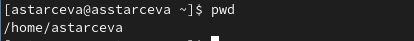

:::

::: {.column width="50%"}

Определили полное имя домашнего каталога.

:::

::::::::::::::

## Команда ls

:::::::::::::: {.columns align=center}

::: {.column width="30%"}

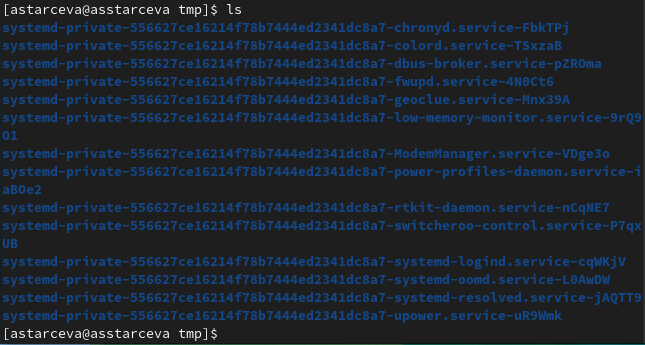

:::

::: {.column width="30%"}

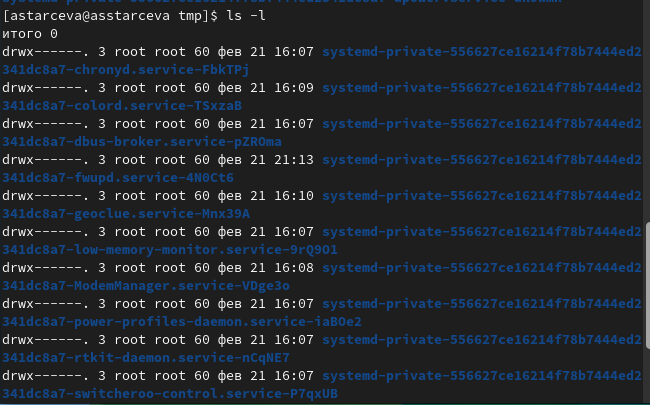

:::

::: {.column width="30%"}

:::

::::::::::::::

## Команды mkdir и rmdir

:::::::::::::: {.columns align=center}

::: {.column width="30%"}

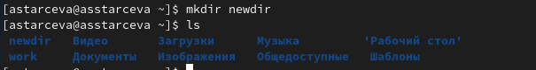

:::

::: {.column width="30%"}

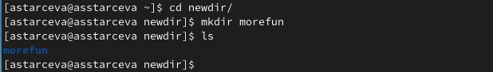

:::

::: {.column width="30%"}

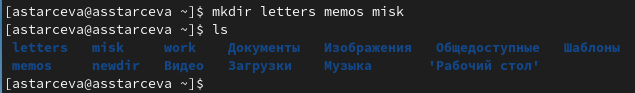

:::

::::::::::::::

## Команда man

:::::::::::::: {.columns align=center}

::: {.column width="30%"}

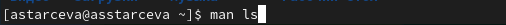

:::

::: {.column width="30%"}

:::

::: {.column width="30%"}

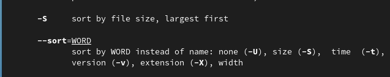

:::

::::::::::::::

## Команда man

:::::::::::::: {.columns align=center}

::: {.column width="50%"}

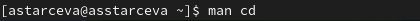

:::

::: {.column width="50%"}

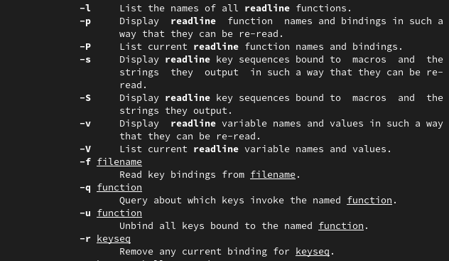

:::
::::::::::::::

## Команда man

:::::::::::::: {.columns align=center}

::: {.column width="50%"}

:::

::: {.column width="50%"}

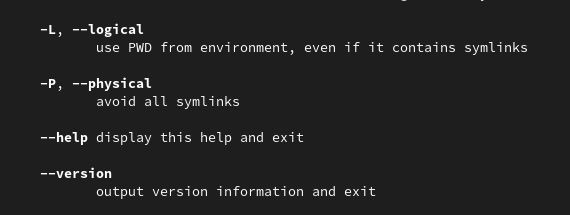

:::
::::::::::::::

## Команда history

:::::::::::::: {.columns align=center}

::: {.column width="30%"}

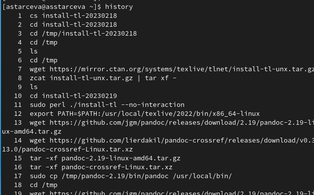

:::

::: {.column width="30%"}

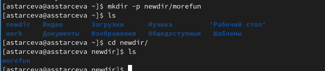

:::

::: {.column width="30%"}

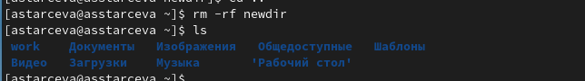

:::

::::::::::::::

## Ответы на контрольные вопросы

:::::::::::::: {.columns align=center}

::: {.column width="50%"}

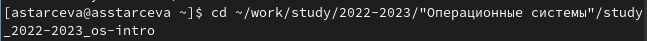

:::

::: {.column width="50%"}

:::
::::::::::::::

# Результаты

## Выводы из лабораторной работы №4

В ходе выполнения лабораторной работы были приобретены практические навыки взаимодействия пользователя с системой посредством командной строки.

