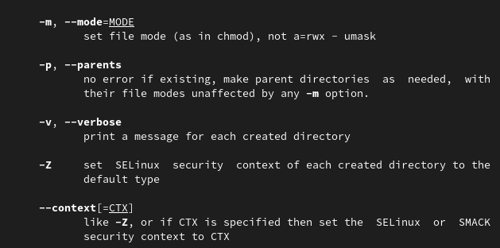

---
## Front matter
title: "Отчёт по лабораторной работе № 4"
subtitle: "Основы интерфейса взаимодействия
пользователя с системой Unix на уровне командной строки"
author: "Старцева Алина Сергеевна"

## Generic otions
lang: ru-RU
toc-title: "Содержание"

## Bibliography
bibliography: bib/cite.bib
csl: pandoc/csl/gost-r-7-0-5-2008-numeric.csl

## Pdf output format
toc: true # Table of contents
toc-depth: 2
lof: true # List of figures
fontsize: 12pt
linestretch: 1.5
papersize: a4
documentclass: scrreprt
## I18n polyglossia
polyglossia-lang:
  name: russian
  options:
	- spelling=modern
	- babelshorthands=true
polyglossia-otherlangs:
  name: english
## I18n babel
babel-lang: russian
babel-otherlangs: english
## Fonts
mainfont: PT Serif
romanfont: PT Serif
sansfont: PT Sans
monofont: PT Mono
mainfontoptions: Ligatures=TeX
romanfontoptions: Ligatures=TeX
sansfontoptions: Ligatures=TeX,Scale=MatchLowercase
monofontoptions: Scale=MatchLowercase,Scale=0.9
## Biblatex
biblatex: true
biblio-style: "gost-numeric"
biblatexoptions:
  - parentracker=true
  - backend=biber
  - hyperref=auto
  - language=auto
  - autolang=other*
  - citestyle=gost-numeric
## Pandoc-crossref LaTeX customization
figureTitle: "Рис."
tableTitle: "Таблица"
listingTitle: "Листинг"
lofTitle: "Список иллюстраций"
lolTitle: "Листинги"
## Misc options
indent: true
header-includes:
  - \usepackage{indentfirst}
  - \usepackage{float} # keep figures where there are in the text
  - \floatplacement{figure}{H} # keep figures where there are in the text
---

# Цель работы
Приобретение практических навыков взаимодействия пользователя с системой посредством командной строки.

# Задание
– Ознакомиться и разобрать на практике основные команды для работы с коммандной строкой
- Выполнить упражнения
- Ответить на контрольные вопросы

# Выполнение лабораторной работы

## Команда pwd

Определили полное имя домашнего каталога. (рис. [-@fig:001])  Далее относительно этого каталога выполнили последующие упражнения.

{ #fig:001 width=70%}

## Команда ls

Выполнили следующие действия:
1. Перешли в каталог /tmp. (рис. [-@fig:002])

{ #fig:002 width=70%}

2. Вывели на экран содержимое каталога /tmp. Для этого использовали команду ls
с различными опциями. (рис. [-@fig:003]), (рис. [-@fig:004]), (рис. [-@fig:005]), (рис. [-@fig:006])

{ #fig:003 width=70%}

{ #fig:004 width=70%}

{ #fig:005 width=70%}

{ #fig:006 width=70%}

3. В каталоге /var/spool подкаталог с именем cron отсутствует. (рис. [-@fig:007])

{ #fig:007 width=70%}

4. Перешли в домашний каталог и вывели на экран его содержимое. (рис. [-@fig:008])  asstarceva является владельцем файлов и подкаталогов.

{ #fig:008 width=70%}

## Команды mkdir и rmdir

1. В домашнем каталоге создали новый каталог с именем newdir. (рис. [-@fig:009])

{ #fig:009 width=70%}

2. В каталоге ~/newdir создали новый каталог с именем morefun. (рис. [-@fig:010])

{ #fig:010 width=70%}

3. В домашнем каталоге создали одной командой три новых каталога с именами
letters, memos, misk. Затем удалили эти каталоги одной командой. (рис. [-@fig:011]), (рис. [-@fig:012])

{ #fig:011 width=70%}

{ #fig:012 width=70%}

4. Попробовали удалить ранее созданный каталог ~/newdir командой rm. Каталог не был удалён. (рис. [-@fig:013])

{ #fig:013 width=70%}

5. Удалили каталог ~/newdir/morefun из домашнего каталога. Каталог был удалён с последовательным удалением подкаталога. (рис. [-@fig:014]), (рис. [-@fig:015])

{ #fig:014 width=70%}

{ #fig:015 width=70%}

## Команда man

1. С помощью команды man определили, какую опцию команды ls нужно использовать для просмотра содержимое не только указанного каталога, но и подкаталогов, входящих в него. (рис. [-@fig:016]), (рис. [-@fig:017])

{ #fig:016 width=70%}

{ #fig:017 width=70%}

2. С помощью команды man определили набор опций команды ls, позволяющий отсортировать по времени последнего изменения выводимый список содержимого каталога с развёрнутым описанием файлов. (рис. [-@fig:018]), (рис. [-@fig:019])

{ #fig:018 width=70%}

{ #fig:019 width=70%}

3. Используя команду man для просмотра описания следующих команд: cd, pwd, mkdir,
rmdir, rm.
Основные опции этих команд:
(рис. [-@fig:020]), (рис. [-@fig:021]), (рис. [-@fig:022]), (рис. [-@fig:023]), (рис. [-@fig:024]), (рис. [-@fig:025]),
(рис. [-@fig:026]), (рис. [-@fig:027]), (рис. [-@fig:028]), (рис. [-@fig:029])

{ #fig:020 width=70%}

{ #fig:021 width=70%}

{ #fig:022 width=70%}

{ #fig:023 width=70%}

{ #fig:024 width=70%}

{ #fig:025 width=70%}

{ #fig:026 width=70%}

{ #fig:027 width=70%}

{ #fig:028 width=70%}

{ #fig:029 width=70%}

## Команда history

7. Используя информацию, полученную при помощи команды history, выполнили модификацию и исполнение нескольких команд из буфера команд. рис. ([-@fig:030], рис. [-@fig:031], рис. [-@fig:032])

{ #fig:030 width=70%}

{ #fig:031 width=70%}

{ #fig:032 width=70%}

# Выводы

В ходе выполнения лабораторной работы были приобретены практические навыки взаимодействия пользователя с системой посредством командной строки.

# Ответы на контрольные вопросы

1. Что такое командная строка?
Терминал Линукс (Linux Terminal) — это программа, которая используется для взаимодействия с командной оболочкой. Ее второе название — командная строка Линукс. Терминал предназначен для администрирования ОС: установки и удаления программ, работы с файловой системой и др.
2. При помощи какой команды можно определить абсолютный путь текущего каталога? (pwd)
Пример.

{ #fig:033 width=70%}

3. При помощи какой команды и каких опций можно определить только тип файлов
и их имена в текущем каталоге? (ls)
Примеры. (рис. [-@fig:034], рис. [-@fig:035])

{ #fig:034 width=70%}

{ #fig:035 width=70%}

4. Каким образом отобразить информацию о скрытых файлах? (ls -a)
Пример. (рис. [-@fig:036])

{ #fig:036 width=70%}

5. При помощи каких команд можно удалить файл и каталог? (rm, rmdir) Можно ли это сделать
одной и той же командой? (yes) 
Примеры. (рис. [-@fig:037]), (рис. [-@fig:038])

{ #fig:037 width=70%}

{ #fig:038 width=70%}

6. Каким образом можно вывести информацию о последних выполненных пользователем командах? (history)
7. Как воспользоваться историей команд для их модифицированного выполнения? 
Примеры. (рис. [-@fig:039]), (рис. [-@fig:040])

{ #fig:039 width=70%}

{ #fig:040 width=70%}

8. Приведите примеры запуска нескольких команд в одной строке.
9. Дайте определение и приведите примера символов экранирования.
10. Охарактеризуйте вывод информации на экран после выполнения команды ls с опцией
l. (рис. [-@fig:041])

{ #fig:041 width=70%}

11. Что такое относительный путь к файлу? 
Примеры использования относительного и абсолютного пути при выполнении какой-либо команды. (рис. [-@fig:042]), (рис. [-@fig:043])

{ #fig:042 width=70%}

{ #fig:043 width=70%}

12. Как получить информацию об интересующей вас команде? (man, help)
13. Какая клавиша или комбинация клавиш служит для автоматического дополнения
вводимых команд? (Tab)

	
	
