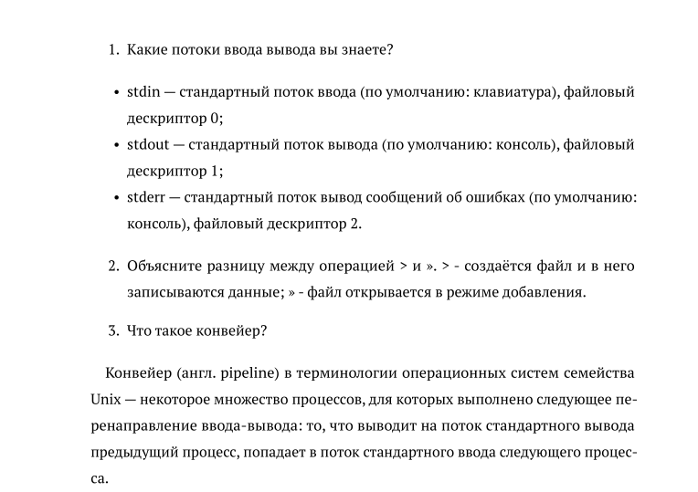

---
## Front matter
lang: ru-RU
title: Поиск файлов. Перенаправление ввода-вывода. Просмотр запущенных процессов
subtitle: Лабораторная работа №6
author:
  - Старцева А. С.
institute:
  - Российский университет дружбы народов, Москва, Россия
date: 17 марта 2023

## i18n babel
babel-lang: russian
babel-otherlangs: english

## Formatting pdf
toc: false
toc-title: Содержание
slide_level: 2
aspectratio: 169
section-titles: true
theme: metropolis
header-includes:
 - \metroset{progressbar=frametitle,sectionpage=progressbar,numbering=fraction}
 - '\makeatletter'
 - '\beamer@ignorenonframefalse'
 - '\makeatother'
backgroundColor: orange
---

# Информация

## Докладчик

:::::::::::::: {.columns align=center}
::: {.column width="60%"}

  * Старцева Алина Сергеевна
  * студент 1 курса, группа НММбд-03-22
  * Российский университет дружбы народов

:::
::: {.column width="40%"}

:::
::::::::::::::

# Вводная часть

## Объект и предмет исследования

- Инструменты поиска файлов и фильтрации текстовых данных
- Файлы и текстовые данные

## Цель работы

- Ознакомление с инструментами поиска файлов и фильтрации текстовых данных.
Приобретение практических навыков: по управлению процессами (и заданиями), по
проверке использования диска и обслуживанию файловых систем.

## Задание
- Ознакомиться и разобрать на практике основные инструменты поиска файлов и фильтрации текстовых данных.
- Выполнить упражнения.
- Ответить на контрольные вопросы.

# Выполнение лабораторной работы №6

## Команды поиска и фильтрации

:::::::::::::: {.columns align=center}

::: {.column width="30%"}

:::

::: {.column width="30%"}

:::

::: {.column width="30%"}

:::

::::::::::::::

## Запуск команд в фоновом режиме

:::::::::::::: {.columns align=center}

::: {.column width="30%"}

:::

::: {.column width="30%"}

:::

::: {.column width="30%"}

:::

::::::::::::::

## Определение идентификатора процесса

:::::::::::::: {.columns align=center}

::: {.column width="30%"}

:::

::: {.column width="30%"}

:::

::: {.column width="30%"}

:::

::::::::::::::

##  Комманда kill

:::::::::::::: {.columns align=center}

::: {.column width="30%"}

:::

::: {.column width="30%"}

:::

::: {.column width="30%"}

:::

::::::::::::::

## Команды df, du

:::::::::::::: {.columns align=center}

::: {.column width="30%"}

:::

::: {.column width="30%"}

:::

::: {.column width="30%"}

:::

::::::::::::::

## Команды df, du

:::::::::::::: {.columns align=center}

::: {.column width="30%"}

:::

::: {.column width="30%"}

:::

::: {.column width="30%"}

:::
::::::::::::::

## Команда find

:::::::::::::: {.columns align=center}

::: {.column width="30%"}

:::

::: {.column width="30%"}

:::

::: {.column width="30%"}

:::
::::::::::::::

## Ответы на контрольные вопросы

:::::::::::::: {.columns align=center}

::: {.column width="50%"}

:::

::: {.column width="50%"}

:::
::::::::::::::

# Результаты

## Выводы из лабораторной работы №6

В ходе выполнения лабораторной работы ознакомились с инструментами поиска файлов и фильтрации текстовых данных.
Приобретение практических навыков: по управлению процессами (и заданиями), по
проверке использования диска и обслуживанию файловых систем.

