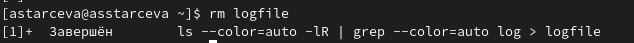

---
## Front matter
title: "Отчёт по лабораторной работе № 6"
subtitle: "Поиск файлов. Перенаправление
ввода-вывода. Просмотр запущенных процессов"
author: "Старцева Алина Сергееевна"

## Generic otions
lang: ru-RU
toc-title: "Содержание"

## Bibliography
bibliography: bib/cite.bib
csl: pandoc/csl/gost-r-7-0-5-2008-numeric.csl

## Pdf output format
toc: true # Table of contents
toc-depth: 2
lof: true # List of figures
fontsize: 12pt
linestretch: 1.5
papersize: a4
documentclass: scrreprt
## I18n polyglossia
polyglossia-lang:
  name: russian
  options:
	- spelling=modern
	- babelshorthands=true
polyglossia-otherlangs:
  name: english
## I18n babel
babel-lang: russian
babel-otherlangs: english
## Fonts
mainfont: PT Serif
romanfont: PT Serif
sansfont: PT Sans
monofont: PT Mono
mainfontoptions: Ligatures=TeX
romanfontoptions: Ligatures=TeX
sansfontoptions: Ligatures=TeX,Scale=MatchLowercase
monofontoptions: Scale=MatchLowercase,Scale=0.9
## Biblatex
biblatex: true
biblio-style: "gost-numeric"
biblatexoptions:
  - parentracker=true
  - backend=biber
  - hyperref=auto
  - language=auto
  - autolang=other*
  - citestyle=gost-numeric
## Pandoc-crossref LaTeX customization
figureTitle: "Рис."
tableTitle: "Таблица"
listingTitle: "Листинг"
lofTitle: "Список иллюстраций"
lolTitle: "Листинги"
## Misc options
indent: true
header-includes:
  - \usepackage{indentfirst}
  - \usepackage{float} # keep figures where there are in the text
  - \floatplacement{figure}{H} # keep figures where there are in the text
---

# Цель работы
Ознакомление с инструментами поиска файлов и фильтрации текстовых данных.
Приобретение практических навыков: по управлению процессами (и заданиями), по
проверке использования диска и обслуживанию файловых систем.

# Задание
- Ознакомиться и разобрать на практике основные инструменты поиска файлов и фильтрации текстовых данных.
- Выполнить упражнения.
- Ответить на контрольные вопросы.

# Выполнение лабораторной работы

1. Осуществили вход в систему, используя соответствующее имя пользователя.

2. Записали в файл file.txt названия файлов, содержащихся в каталоге /etc. Дописали в этот же файл названия файлов, содержащихся в нашем домашнем каталоге. (рис. [-@fig:001]), (рис. [-@fig:002]), (рис. [-@fig:003]), (рис. [-@fig:004]), (рис. [-@fig:005])

{ #fig:001 width=70%}

{ #fig:002 width=70%}

{ #fig:003 width=70%}

{ #fig:004 width=70%}

{ #fig:005 width=70%}

3. Вывели имена всех файлов из file.txt, имеющих расширение .conf, после чего
записали их в новый текстовой файл conf.txt. (рис. [-@fig:006]), (рис. [-@fig:007]), (рис. [-@fig:008]), (рис. [-@fig:009])

{ #fig:006 width=70%}

{ #fig:007 width=70%}

{ #fig:008 width=70%}

{ #fig:009 width=70%}

4. Определили, какие файлы в нашем домашнем каталоге имеют имена, начинавшиеся
с символа c. Рассмотрели несколько вариантов, как это сделать. (рис. [-@fig:010]), (рис. [-@fig:011])

{ #fig:010 width=70%}

{ #fig:011 width=70%}

5. Вывели на экран (по странично) имена файлов из каталога /etc, начинающиеся
с символа h. (рис. [-@fig:012])

{ #fig:012 width=70%}

6. Запустили в фоновом режиме процесс, который записывает в файл ~/logfile
файлы, имена которых начинаются с log. (рис. [-@fig:013]), (рис. [-@fig:014])

{ #fig:013 width=70%}

{ #fig:014 width=70%}

7. Удалили файл ~/logfile. (рис. [-@fig:015])

{ #fig:015 width=70%}

8. Запустили из консоли в фоновом режиме редактор gedit. (рис. [-@fig:016])

{ #fig:016 width=70%}

9. Определили идентификатор процесса gedit, используя команду ps, конвейер и фильтр
grep, pidof. (рис. [-@fig:017]), (рис. [-@fig:018]), (рис. [-@fig:019])

{ #fig:017 width=70%}

{ #fig:018 width=70%}

{ #fig:019 width=70%}

10. Прочли справку (man) команды kill, после чего использовали её для завершения
процесса gedit. (рис. [-@fig:020]), (рис. [-@fig:021]), (рис. [-@fig:022])

{ #fig:020 width=70%}

{ #fig:021 width=70%}

{ #fig:022 width=70%}

11. Выполнили команды df и du, предварительно получив более подробную информацию
об этих командах, с помощью команды man. (рис. [-@fig:023]), (рис. [-@fig:024]), (рис. [-@fig:025]), (рис. [-@fig:026]), (рис. [-@fig:027]), (рис. [-@fig:028])

{ #fig:023 width=70%}

{ #fig:024 width=70%}

{ #fig:025 width=70%}

{ #fig:026 width=70%}

{ #fig:027 width=70%}

{ #fig:028 width=70%}

12. Воспользовавшись справкой команды find, вывели имена всех директорий, имеющихся в нашем домашнем каталоге. (рис. [-@fig:029]), (рис. [-@fig:030]), (рис. [-@fig:031])

{ #fig:029 width=70%}

{ #fig:030 width=70%}

{ #fig:031 width=70%}

# Выводы

В ходе выполнения лабораторной работы ознакомились с инструментами поиска файлов и фильтрации текстовых данных.
Приобретение практических навыков: по управлению процессами (и заданиями), по
проверке использования диска и обслуживанию файловых систем.

# Ответы на контрольные вопросы

1. Какие потоки ввода вывода вы знаете?
- stdin — стандартный поток ввода (по умолчанию: клавиатура), файловый дескриптор
0;
- stdout — стандартный поток вывода (по умолчанию: консоль), файловый дескриптор
1;
- stderr — стандартный поток вывод сообщений об ошибках (по умолчанию: консоль),
файловый дескриптор 2.

2. Объясните разницу между операцией > и >>.
> - создаётся файл и в него записываются данные;
>> - файл открывается в режиме добавления.

3. Что такое конвейер?

Конвейер (англ. pipeline) в терминологии операционных систем 
семейства Unix — некоторое множество процессов, для которых 
выполнено следующее перенаправление ввода-вывода: то, что выводит 
на поток стандартного вывода предыдущий процесс, попадает в 
поток стандартного ввода следующего процесса.

4. Что такое процесс? Чем это понятие отличается от программы?
Процесс относится к выполнению программы - он представляет собой 
запущенный экземпляр программы, составленный из инструкций, данных, 
считанных из файлов, других программ, или полученных от пользователя.

5. Что такое PID и GID?
PID означает идентификатор процесса, Что означает идентификационный
 номер для текущего процесса в памяти.
 Идентификатор группы, часто сокращенно GID, представляет собой числовое
 значение, используемое для представления определенной группы.

6. Что такое задачи и какая команда позволяет ими управлять?
Термин задача используется в ядре Linux для обозначения единицы выполнения, 
которая может совместно использовать различные системные ресурсы с другими 
задачами в системе.
Комманда управления задачами jobs.

7. Найдите информацию об утилитах top и htop. Каковы их функции?
- Top : Программа позволяет интерактивно просматривать список 
запущенных процессов Linux.

- Htop: Это ещё более мощная утилита для просмотра запущенных 
процессов в Linux. Пользоваться ею намного удобнее. Здесь 
поддерживаются не только горячие клавиши, но и управление мышью. 
Она выводит всё в цвете, поэтому смотреть на данные 
намного приятнее.

8. Назовите и дайте характеристику команде поиска файлов. Приведите
 примеры использования этой команды.

Команда find используется для поиска и отображения на экран имён файлов, 
соответствующих заданной строке символов.

9. Можно ли по контексту (содержанию) найти файл? Если да, то как?

В Linux всё это делается с помощью одной весьма простой, но в то же 
время мощной утилиты grep. С её помощью можно искать не только 
строчки в файлах, но и фильтровать вывод команд.

10. Как определить объем свободной памяти на жёстком диске?(df)

11. Как определить объем вашего домашнего каталога?(df -h /home)

12. Как удалить зависший процесс? (kill)

