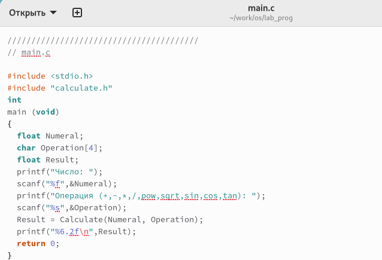
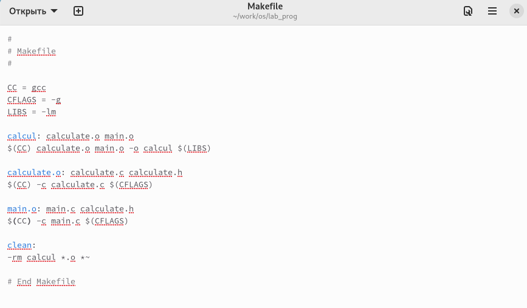
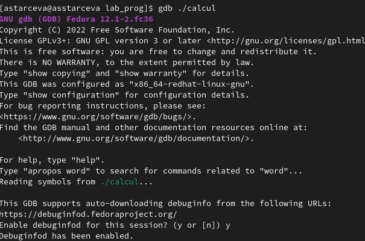
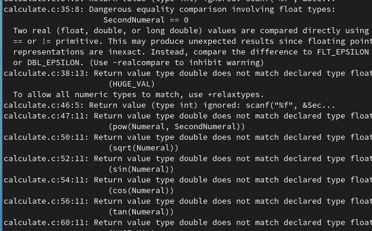
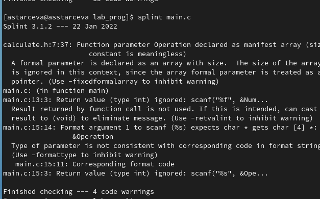

---
## Front matter
title: "Отчёт по лабораторной работе № 13"
subtitle: "Средства, применяемые при
разработке программного обеспечения в ОС типа UNIX/Linux"
author: "Старцева Алина Сергеевна"

## Generic otions
lang: ru-RU
toc-title: "Содержание"

## Bibliography
bibliography: bib/cite.bib
csl: pandoc/csl/gost-r-7-0-5-2008-numeric.csl

## Pdf output format
toc: true # Table of contents
toc-depth: 2
lof: true # List of figures
fontsize: 12pt
linestretch: 1.5
papersize: a4
documentclass: scrreprt
## I18n polyglossia
polyglossia-lang:
  name: russian
  options:
	- spelling=modern
	- babelshorthands=true
polyglossia-otherlangs:
  name: english
## I18n babel
babel-lang: russian
babel-otherlangs: english
## Fonts
mainfont: PT Serif
romanfont: PT Serif
sansfont: PT Sans
monofont: PT Mono
mainfontoptions: Ligatures=TeX
romanfontoptions: Ligatures=TeX
sansfontoptions: Ligatures=TeX,Scale=MatchLowercase
monofontoptions: Scale=MatchLowercase,Scale=0.9
## Biblatex
biblatex: true
biblio-style: "gost-numeric"
biblatexoptions:
  - parentracker=true
  - backend=biber
  - hyperref=auto
  - language=auto
  - autolang=other*
  - citestyle=gost-numeric
## Pandoc-crossref LaTeX customization
figureTitle: "Рис."
tableTitle: "Таблица"
listingTitle: "Листинг"
lofTitle: "Список иллюстраций"
lolTitle: "Листинги"
## Misc options
indent: true
header-includes:
  - \usepackage{indentfirst}
  - \usepackage{float} # keep figures where there are in the text
  - \floatplacement{figure}{H} # keep figures where there are in the text
---

# Цель работы
Приобрести простейшие навыки разработки, анализа, тестирования и отладки приложений в ОС типа UNIX/Linux на примере создания на языке программирования
С калькулятора с простейшими функциями.

# Задание
- Ознакомиться с теоретическим материалом.
- Выполнить упражнения.
- Ответить на контрольные вопросы.

# Выполнение лабораторной работы

## Работа с программой калькулятор

1. В домашнем каталоге создали подкаталог ~/work/os/lab_prog.(рис. [-@fig:001])

{ #fig:001 width=70%}

2. Создали в нём файлы: calculate.h, calculate.c, main.c. (рис. [-@fig:002])

{ #fig:002 width=70%}

Это примитивнейший калькулятор, способный складывать, вычитать, умножать
и делить, возводить число в степень, брать квадратный корень, вычислять sin, cos, tan.
При запуске он запрашивает первое число, операцию, второе число. После этого
программа выводит результат и останавливается.
Реализация функций калькулятора в файле calculate.с:(рис. [-@fig:003])

{ #fig:003 width=70%}

Интерфейсный файл calculate.h, описывающий формат вызова функциикалькулятора: (рис. [-@fig:004])

{ #fig:004 width=70%}

Основной файл main.c, реализующий интерфейс пользователя к калькулятору:(рис. [-@fig:005])

{ #fig:005 width=70%}

3. Выполнили компиляцию программы посредством gcc: (рис. [-@fig:006])

{ #fig:006 width=70%}

4. Исправили синтаксические ошибки.
5. Создали Makefile. (рис. [-@fig:007]), (рис. [-@fig:008])

{ #fig:007 width=70%}

{ #fig:008 width=70%}

6. С помощью gdb выполнили отладку программы calcul:
– Запустили отладчик GDB, загрузив в него программу для отладки:(рис. [-@fig:009])

{ #fig:009 width=70%}

– Для запуска программы внутри отладчика ввели команду run:(рис. [-@fig:010])

{ #fig:010 width=70%}

– Для постраничного (по 9 строк) просмотра исходного код использовали команду list (рис. [-@fig:011])

{ #fig:011 width=70%}

– Для просмотра строк с 1 по 4 основного файла использовали list с параметрами:(рис. [-@fig:012])

{ #fig:012 width=70%}

– Для просмотра определённых строк не основного файла использовали list с параметрами: (рис. [-@fig:013])

{ #fig:013 width=70%}

– Установили точку останова в файле calculate.c на строке номер 21: (рис. [-@fig:014])

{ #fig:014 width=70%}

– Вывели информацию об имеющихся в проекте точка останова: (рис. [-@fig:015])

{ #fig:015 width=70%}

– Запустили программу внутри отладчика и убедились, что программа остановится
в момент прохождения точки останова.
– Посмотрели, чему равно на этом этапе значение переменной Numeral, введя:(рис. [-@fig:016])

{ #fig:016 width=70%}

– Сравнили с результатом вывода на экран после использования команды: (рис. [-@fig:017])

{ #fig:017 width=70%}

– Убрали точки останова: (рис. [-@fig:018])

{ #fig:018 width=70%}

7. С помощью утилиты splint попробовали проанализировать коды файлов calculate.c
и main.c. (рис. [-@fig:020]), (рис. [-@fig:019])

{ #fig:019 width=70%}

{ #fig:020 width=70%}

# Выводы

В ходе выполнения были приобретены простейшие навыки разработки, анализа, тестирования и отладки приложений в ОС типа UNIX/Linux на примере создания на языке программирования С калькулятора с простейшими функциями.

# Ответы на контрольные вопросы

1. Чтобы получить информацию о возможностях программ gcc, make, gdb и др. нужно воспользоваться командой man или опцией -help (-h) для каждой команды.

2. Процесс разработки программного обеспечения обычно разделяется на следующие этапы: • планирование, включающее сбор и анализ требований к функционалу и другим характеристикам разрабатываемого приложения; • проектирование, включающее в себя разработку базовых алгоритмов и спецификаций, определение языка программирования; • непосредственная разработка приложения: – кодирование − по сути создание исходного текста программы (возмож- но в нескольких вариантах); – анализ разработанного кода; – сборка, компиляция и разработка исполняемого модуля; – тестирование и отладка, сохранение произведённых изменений; • документирование. Для создания исходного текста программы разработчик может воспользоваться любым удобным для него редактором текста: vi, vim, mceditor, emacs, geany и др. После завершения написания исходного кода программы (возможно состоящей из нескольких файлов), необходимо её скомпилировать и получить исполняемый модуль.

3. Для имени входного файла суффикс определяет какая компиляция требуется. Суффиксы указывают на тип объекта. Файлы с расширением (суффиксом).c воспринимаются gcc как программы на языке С, файлы с расширением .cc или .C − как файлы на языке C++, а файлы c расширением .o считаются объектными. Например, в команде «gcc -c main.c»: gcc по расширению (суффиксу) .c распознает тип файла для компиляции и формирует объектный модуль − файл с расширением .o. Если требуется получить исполняемый файл с определённым именем (например, hello), то требуется воспользоваться опцией -o и в качестве параметра задать имя создаваемого файла: «gcc -o hello main.c».

4. Основное назначение компилятора языка Си в UNIX заключается в компи- ляции всей программы и получении исполняемого файла/модуля.

5. Для сборки разрабатываемого приложения и собственно компиляции по- лезно воспользоваться утилитой make. Она позволяет автоматизировать процесс преобразования файлов программы из одной формы в другую, отслеживает взаимосвязи между файлами.

6. Для работы с утилитой make необходимо в корне рабочего каталога с Вашим проектом создать файл с названием makefile или Makefile, в котором будут описаны правила обработки файлов Вашего программного комплекса. В самом простом случае Makefile имеет следующий синтаксис: ... : ... <команда 1> ... Сначала задаётся список целей, разделённых пробелами, за которым идёт двоеточие и список зависимостей. Затем в следующих строках указываются команды. Строки с командами обязательно должны начинаться с табуляции. В качестве цели в Makefile может выступать имя файла или название какого-то действия. Зависимость задаёт исходные параметры (условия)для достижения указанной цели. Зависимость также может быть названи- ем какого-то действия. Команды − собственно действия, которые необхо- димо выполнить для достижения цели. Общий синтаксис Makefile имеет вид: target1 [target2...]:[:] [dependment1...] [(tab)commands] [#commentary] [(tab)commands] [#commentary] Здесь знак # определяет начало комментария (содержимое от знака # и до конца строки не будет обрабатываться. Одинарное двоеточие указывает на то, что последовательность команд должна содержаться в одной строке. Для переноса можно в длинной строке команд можно использовать обратный слэш (). Двойное двоеточие указыва- ет на то, что последовательность команд может содержаться в нескольких последовательных строках. Пример более сложного синтаксиса Makefile: Makefile for abcd.c # CC = gcc CFLAGS = #Compile abcd.c normaly abcd: abcd.c 
(CFLAGS) abcd.c clean: -rm abcd .o ~ #End Makefile for abcd.c В этом примере в начале файла заданы три переменные: CC и CFLAGS. Затем указаны цели, их зависимости и соответствующие команды. В командах происходит обращение к значениям переменных. Цель с именем clean про- изводит очистку каталога от файлов, полученных в результате компиляции. Для её описания использованы регулярные выражения.

7. Во время работы над кодом программы программист неизбежно сталкивается с появлением ошибок в ней. Использование отладчика для поиска иустранения ошибок в программе существенно облегчает жизнь программи- ста. В комплект программ GNU для ОС типа UNIX входит отладчик GDB (GNU Debugger). Для использования GDB необходимо скомпилировать анализи- руемый код программы таким образом, чтобы отладочная информация содержалась в результирующем бинарном файле. Для этого следует вос- пользоваться опцией -g компилятора gcc: gcc -c file.c -g После этого для начала работы с gdb необходимо в командной строке ввести одноимённую команду, указав в качестве аргумента анализируемый бинарный файл: gdb file.o

8. Основные команды отладчика gdb:

backtrace − вывод на экран пути к текущей точке останова (по сути вывод −названий всех функций)
break − установить точку останова (в качестве параметра может быть указанномер строки или название функции)
clear − удалить все точки останова в функции
continue − продолжить выполнение программы
delete − удалить точку останова
display − добавить выражение в список выражений, значения которых отображаются при достижении точки останова программы
finish − выполнить программу до момента выхода из функции
info breakpoints − вывести на экран список используемых точек останова
info watchpoints − вывести на экран список используемых контрольных выражений
list − вывести на экран исходный код (в качестве параметра может быть указано название файла и через двоеточие номера начальной и конечной строк)
next − выполнить программу пошагово, но без выполнения вызываемых в программе функций
print − вывести значение указываемого в качестве параметра выражения
run − запуск программы на выполнение
set − установить новое значение переменной
step − пошаговое выполнение программы
watch − установить контрольное выражение, при изменении значения ко- торого программа будет остановлена Для выхода из gdb можно воспользо- ваться командой quit (или её сокращённым вариантом q) или комбинацией клавиш Ctrl-d. Более подробную информацию по работе с gdb можно полу- чить с помощью команд gdb -h и man gdb.
Cхема отладки программы показана в 6 пункте лабораторной работы.

9. При первом запуске компилятор не выдал никаких ошибок, но в коде программы main.c допущена ошибка, которую компилятор мог пропустить (возможно, из-за версии 8.3.0-19): в строке scanf(“%s”, &Operation); нужноубрать знак &, потому что имя массива символов уже является указателем на первый элемент этого массива.

10. Система разработки приложений UNIX предоставляет различные средства, повышающие понимание исходного кода. К ним относятся:

cscope − исследование функций, содержащихся в программе,

lint − критическая проверка программ, написанных на языке Си.

12. Утилита splint анализирует программный код, проверяет корректность задания аргументов использованных в программе функций и типов возвра- щаемых значений, обнаруживает синтаксические и семантические ошибки. В отличие от компилятора C анализатор splint генерирует комментарии с описанием разбора кода программы и осуществляет общий контроль, обна- руживая такие ошибки, как одинаковые объекты, определённые в разных файлах, или объекты, чьи значения не используются в работ программы, переменные с некорректно заданными значениями и типами и многое другое
